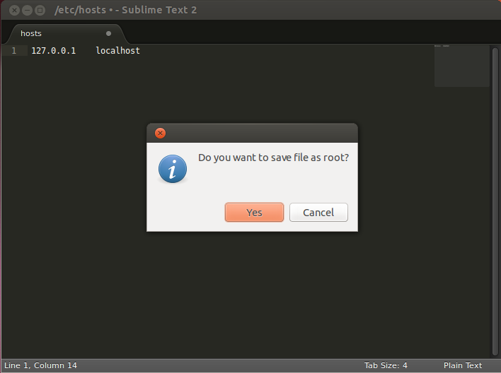

# [Superlime](https://github.com/azubr/Superlime)
Requests root/admin rights if a file cannot be saved in SublimeText

### Compatibility
* Linux (depends on gksudo or kdesudo)
* Windows (depends on PowerShell)

* Sublime Text 2
* Sublime Text 3 (with "atomic save" switched off)

Mac version of SublimeText supports such functionality natively

### Plugin installation
* There are two ways to install the plugin:
  1. Search for Superlime in Package Control
  2. Clone this repository to SublimeText Packages folder
* Set "atomic_save" setting to false in Sublime Text 3 
 

Homepage: http://projects.zubr.me/wiki/Superlime
